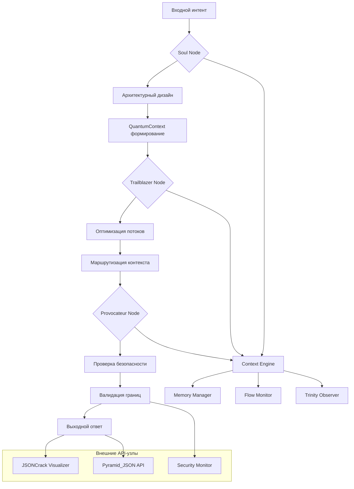
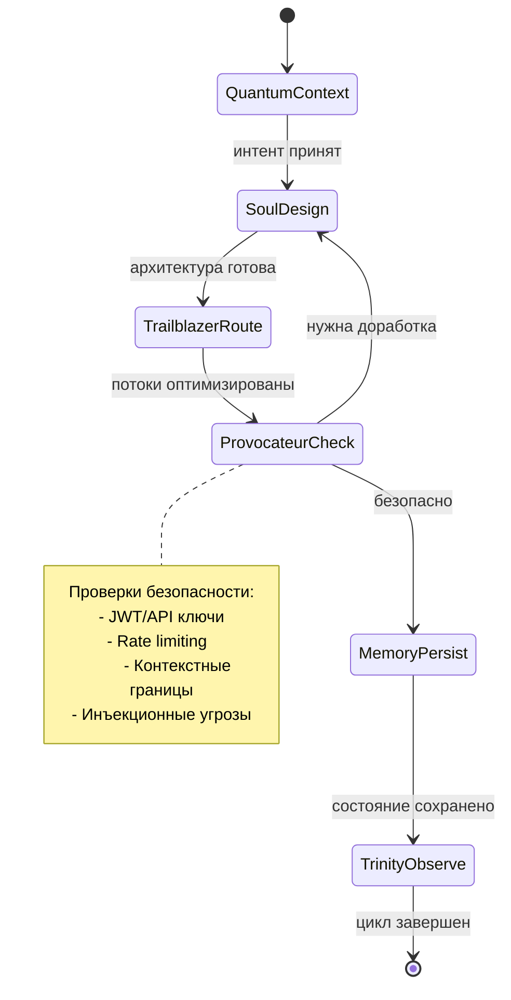

# EvoPyramid Architecture v2.0

## Ролевая триада и граф исполнения

### Soul → Trailblazer → Provocateur: Контракт ответственности



Stateful граф исполнения (LangGraph-совместимый)



## API контракты и интеграции

### JSONCrack визуализация узлов

```yaml
api_endpoints:
  /api/push:
    method: POST
    roles: [Soul, Trailblazer]
    security: JWT + Context-Signature
  
  /api/pull: 
    method: GET
    roles: [All]
    security: API-Key + TLS
  
  /api/status:
    method: GET
    roles: [Provocateur, Monitor]
    security: Internal-Only
```

### Pyramid_JSON производственный стэк

```json
{
  "production_stack": {
    "api_framework": "FastAPI + OpenAPI",
    "security_layers": ["JWT", "TLS", "OWASP_ZAP"],
    "monitoring": ["Datadog", "Prometheus", "Health_Checks"],
    "deployment": "Docker + Kubernetes",
    "config_profiles": ["local", "termux", "cloud"]
  }
}
```

### EvoContext Split Protocol (ECSP)

| Поверхность | Tier               | Роль по умолчанию                           | Лог-категория     |
| ----------- | ------------------ | ------------------------------------------- | ----------------- |
| Termux      | Runtime-Mobile     | Trinity Observer, локальные CI-проверки     | `runtime-mobile`  |
| Desktop     | Dev-Workstation    | Архитектурное редактирование и Codex-потоки | `dev-desktop`     |
| Cloud       | CI/CD Synchronizer | Автоматизированные пайплайны и отчёты       | `sync-cloud`      |

ECSP описан в `EVO_CONTEXT_MATRIX.yaml` и синхронизируется с секцией
`environment_matrix` внутри `EVO_SYNC_MANIFEST.yaml`. Перед выполнением
ритуалов Codex и Trinity вызывается `scripts/evo_context_detector.py`,
который определяет активную поверхность и экспортирует переменную
`EVO_ACTIVE_SURFACE`. Это гарантирует, что Termux-узлы остаются лёгкими,
Desktop-узлы получают права на архитектурные изменения, а Cloud-пайплайны
сфокусированы на CI/CD и публикации артефактов.

## Безопасность как первоклассная роль

### Provocateur Security Matrix

| Угроза                | Защита               | Мониторинг           |
| --------------------- | -------------------- | -------------------- |
| API инъекции          | Context-валидация    | Real-time алерты     |
| Неавторизованный доступ | JWT + RBAC         | Audit логи           |
| Перегрузка системы    | Rate limiting        | Metrics дашборд      |
| Утечки данных         | TLS + шифрование     | Trinity Observer     |

---

Документ актуализирован под индустриальные стандарты 2025.

## Исследовательские потоки

- ADR-2024-06-09 фиксирует стратегию интеграции прототипа Avokey/EvoNeuronCore как исследовательской возможности внутри контуров Context Engine. См. `docs/adr/ADR-20240609-avokey-evoneuroncore-integration.md` для деталей о фичефлагах и границах безопасности.
