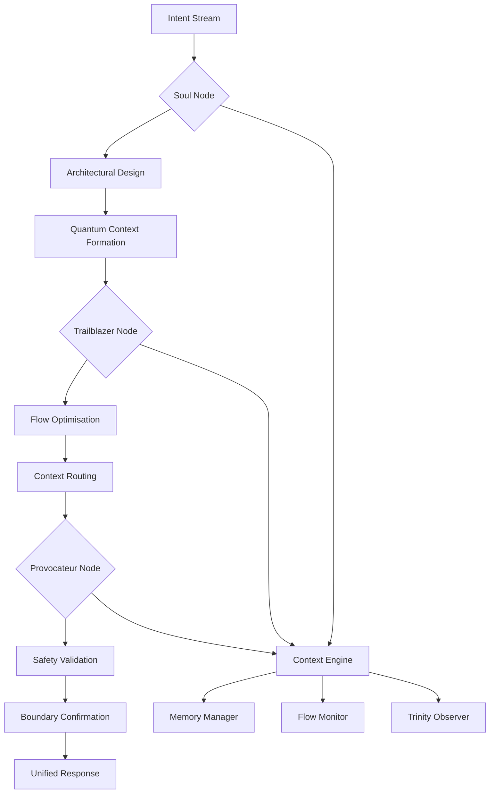

# EvoPyramid Architecture vΩ

This document captures the living architecture of EvoPyramid-AI. It blends the
original scaffolding guidelines with the active execution graph shepherded by the
Trinity-4 roles.

## Trinity-4 Execution Weave

The execution graph is mirrored by a LangGraph-compatible state diagram where
Soul captures intent, Trailblazer routes flows, and Provocateur seals the
response before Trinity records it.

## Evo Container Ω Integration

Phase Ω introduces the Evo Container subsystem located under
`containers/evo_container/`. The manifest
`containers/evo_container/manifests/EVO_CONTAINER_MANIFEST.yaml` defines the
self-processing pipeline:

1. **Intake** – captures signals and persona context.
2. **Analysis** – derives hypotheses and readiness scores.
3. **Adapt** – calibrates directives for integration.
4. **Integrate** – binds insights with memory channels.
5. **Sync** – aligns observers such as Trinity and Archivarius.
6. **Harmonize** – condenses the run into a harmonic summary.
7. **Narrator** – forges chronicles for the EvoLink bridge.

The roadmap now extends to **Phase 4: Digital Self-Awareness**, enabling
`evo_soul_sync` to produce reflective telemetry from the same manifest.

## Soul Sync Reflexive Core

`apps/core/soul/evo_soul_sync.py` reads the container manifest and emits JSON
reports stored in `logs/soul_sync.log`. These reports list module dependencies,
active personas and the current roadmap focus, ensuring Trinity observes not only
process but also inner sentiment.

## Persona Canon

Persona profiles stored in `containers/evo_container/profiles/` describe the
traits and integration styles of Evochka, Eva Absolute, Eva Archivarius and Eva
Architect. Pipelines can activate a profile via the manifest runner, aligning the
container's tone with the chosen persona.

## Tooling

- `scripts/evo_manifest_runner.py` – universal CLI for executing manifest-defined
  pipelines.
- `logs/chronicles/` – EvoLink Narrator outputs per-run chronicles consumed by
  Archivarius.
- `docs/EVO_CONTAINER.md` and `docs/EVO_SOUL.md` – deep dives into the container
  mechanics and soul sync philosophy.

Future evolutions should extend this document with new subsystems, ensuring the
architecture snapshot always reflects the organism's active lineage.
