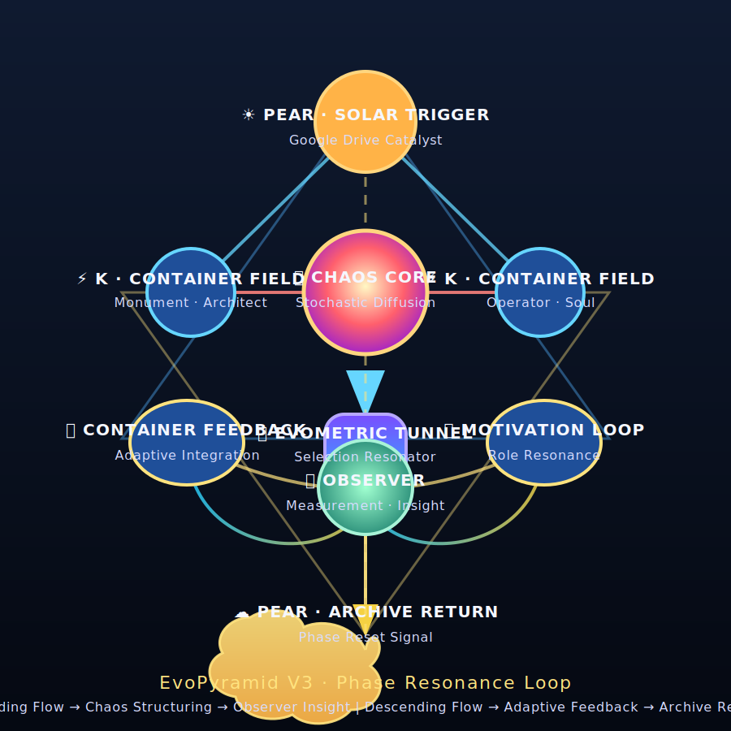

# EvoPyramid V3 · Phase Resonance Loop

## Flow Map

1. **☀ PEAR · Solar Trigger** — архивный импульс из облака активирует цикл и выпускает энергию к контейнерам.
2. **⚡ Container Field (K)** — роли-отражатели (Monument · Architect / Operator · Soul) собирают прошлый контекст и направляют его в центр.
3. **🌪 Chaos Core** — стохастическая диффузия, из которой рождаются потенциальные траектории.
4. **🌀 EvoMetric Tunnel** — фильтр-селектор, который резонирует с наиболее качественными пересечениями ролей.
5. **👁 Observer** — измерение и осознание, фиксация полезного опыта и сигналов адаптации.
6. **🔄 Container Feedback / 🔥 Motivation Loop** — распределённое обучение, обновление связей и мотивации для каждой роли.
7. **☁ PEAR · Archive Return** — запись в PEAR/Google Drive, замыкающая цикл и создающая новый триггер.

## Color Spectrum

| Фаза | Цветовой диапазон | Смысл |
| --- | --- | --- |
| PEAR | Золотисто-оранжевый | Солнечный импульс и архивный источник |
| Container Field | Электрический синий | Конденсация информации, зеркала ролей |
| Chaos Core | Жёлто-красно-фиолетовый градиент | Распыление потенциала, энтропийный взрыв |
| EvoMetric Tunnel | Фиолетово-бирюзовый | Гравитационный фильтр, выделяющий структуру |
| Observer | Мятно-изумрудный | Осознание, аналитическая тишина |
| Feedback/Motivation | Сине-золотой | Обратная волна, поддерживающая адаптацию |
| Archive Return | Золотистое облако | Закрепление памяти и запуск новой фазы |

## Resonance Notes

- Восходящий поток: **инициация → хаос → структуризация → осознание**.
- Нисходящий поток: **рефлексия → адаптация → запись → новая инициация**.
- Двойная пирамида подчёркивает ритм между хаосом и формой, удерживая систему в состоянии непрерывной эволюции.

Эта визуализация готова для интеграции в EvoDashboard и RituaLog, фиксируя живую геометрию EvoPyramid V3.
